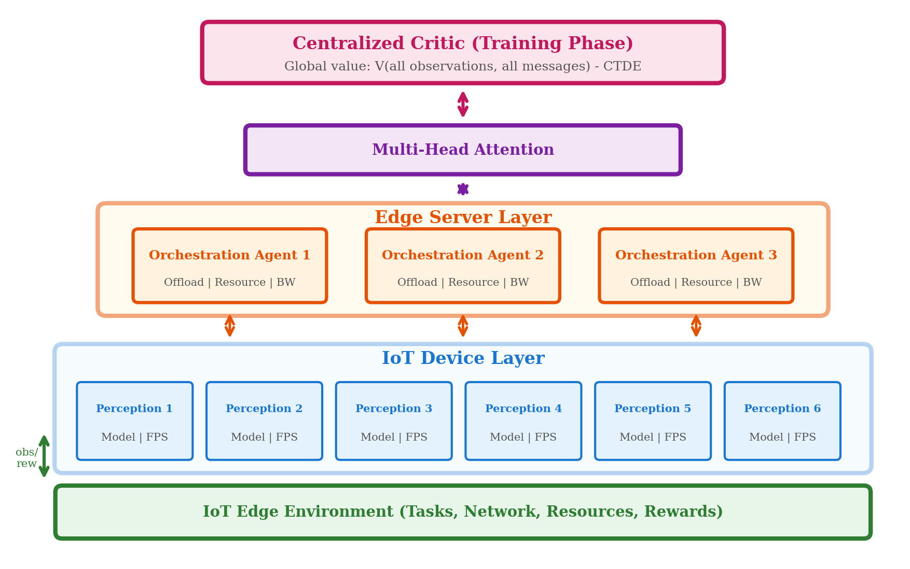

# MARL-IoTP: Multi-Agent Reinforcement Learning for IoT Perception and Task Processing

A hierarchical Multi-Agent Reinforcement Learning framework for joint optimization of perception model selection and resource orchestration in IoT edge computing environments.

## Overview

MARL-IoTP addresses the challenge of coordinating multiple IoT devices and edge servers to optimize perception quality, latency, and energy consumption. The framework uses:

- **Hierarchical Agent Architecture**: Perception agents (IoT devices) and orchestration agents (edge servers)
- **Learned Communication Protocol**: 8-dimensional message encoding between agents
- **Attention-Based Aggregation**: Multi-head attention for processing device messages
- **CTDE Paradigm**: Centralized Training with Decentralized Execution

### Key Results

| Metric | MARL-IoTP | Best Baseline |
|--------|-----------|---------------|
| Classification Accuracy | **90.4%** | 78.5% (MADDPG) |
| Average Latency | **100.9 ms** | 125.4 ms |
| Deadline Violations | **0** | 12.8 |
| Reward | **-403.7** | -520.3 |

## System Architecture



The framework employs **Centralized Training with Decentralized Execution (CTDE)** with:
- **Centralized Critic**: Global value estimation during training
- **Multi-Head Attention**: Aggregates messages from perception agents
- **Heterogeneous Agents**: Specialized perception (IoT) and orchestration (edge) agents

## Repository Structure

```
MARL-IoTP/
├── configs/          # Configuration files (YAML)
│   ├── default.yaml  # Default environment settings
│   └── mappo.yaml    # MAPPO algorithm configuration
├── envs/             # IoT-Edge environment simulation
│   ├── iot_env.py    # Main environment
│   ├── edge_server.py
│   └── network_model.py
├── agents/           # Agent implementations
│   ├── perception_agent.py
│   ├── orchestration_agent.py
│   └── communication.py
├── algorithms/       # RL algorithms
│   ├── mappo.py      # Multi-Agent PPO (main)
│   ├── maddpg.py     # MADDPG baseline
│   ├── baselines.py  # DPTORA, MADOA, heuristics
│   └── networks.py   # Neural network architectures
├── training/         # Training scripts
├── evaluation/       # Evaluation scripts
├── experiments/      # Paper reproduction scripts
├── results/          # Experiment outputs
├── figures/          # Publication figures
├── paper/            # LaTeX source
└── docs/             # Documentation
```

## Installation

```bash
# Clone repository
git clone https://github.com/MHHamdan/MARL-IoTP.git
cd MARL-IoTP

# Create virtual environment
python -m venv venv
source venv/bin/activate  # Linux/Mac
# venv\Scripts\activate   # Windows

# Install dependencies
pip install -r requirements.txt

# Install package (optional)
pip install -e .
```

### Requirements

- Python 3.8+
- PyTorch 2.0+
- CUDA 11.7+ (for GPU training)
- NumPy, Gymnasium, PyYAML, Matplotlib

## Quick Start

### Training

```bash
# Train with default settings (20 devices, 3 servers, 10000 episodes)
python training/train.py --config configs/mappo.yaml

# Custom configuration
python training/train.py \
    --config configs/mappo.yaml \
    --num_devices 30 \
    --num_servers 4 \
    --episodes 5000 \
    --seed 42

# GPU training
CUDA_VISIBLE_DEVICES=0 python training/train.py --config configs/mappo.yaml
```

### Evaluation

```bash
# Evaluate trained model
python evaluation/evaluate.py --checkpoint results/checkpoints/best_model/

# Run baseline comparisons
python evaluation/run_baselines.py
```

## Reproducing Paper Results

### Main Results (Table 1)

```bash
python experiments/exp_main.py --episodes 5000 --seed 42
```

**Expected:** Reward: -403.7, Accuracy: 90.4%, Latency: 100.9ms

### Ablation Study (Table 2)

```bash
python experiments/exp_ablation.py --ablation all --episodes 5000
```

### Scalability Analysis (Figure 5)

```bash
python experiments/exp_scalability.py --device_counts 10 20 30 50
```

### Full Reproduction

```bash
# Run all experiments (~24 hours on single GPU)
./scripts/reproduce_all.sh

# Or use Python script
python experiments/run_all.py --mode full
```

### Generate Figures

```bash
cd figures && python generate_figures.py
```

## Environment Details

### IoT Devices
| Parameter | Value |
|-----------|-------|
| CPU | 1.5 GHz ARM |
| Battery | 5000 mAh |
| Transmit Power | 20 dBm |
| Max Queue | 10 tasks |

### Perception Models
| Model | Accuracy | Latency Factor | FLOPs (M) |
|-------|----------|----------------|-----------|
| MobileNet-Tiny | 65% | 0.3 | 50 |
| MobileNet-Small | 75% | 0.5 | 150 |
| MobileNet-Large | 85% | 0.8 | 300 |
| ResNet-Edge | 92% | 1.0 | 500 |

### Edge Servers
| Parameter | Value |
|-----------|-------|
| CPU | 3.0 GHz (8 cores) |
| Memory | 16 GB |
| Max Tasks | 10 concurrent |

### Network
- Bandwidth: 20 MHz
- Path Loss: 3.5 exponent (urban)
- Channel: Rayleigh fading

## Experimental Methodology

### Simulation-Based Evaluation

Experiments are conducted using a custom **Gymnasium-compatible simulation environment** that models the complete IoT-edge system dynamics. This approach enables reproducible evaluation of MARL algorithms without requiring physical IoT infrastructure deployment.

### Task and Workload Model

The environment generates **perception tasks simulating video frame inference workloads**:
- **Data size**: Sampled around 150KB base with scene complexity variation (Normal distribution, mean=1.0, std=0.3)
- **Computation**: Requirements derived from model FLOPs (50-500 MFLOPS)
- **Deadlines**: Inversely proportional to frame rate selection

### Perception Model Simulation

Accuracy values are based on **published benchmarks** from the MobileNet and EfficientNet model families:
- Models are not executed; instead, accuracy is computed from specifications with stochastic variation
- Scene complexity and resource allocation affect simulated accuracy
- This approach isolates the MARL optimization from specific model implementations

### Latency Computation

End-to-end latency is computed from first principles:
- **Transmission**: Shannon capacity given channel conditions and allocated bandwidth
- **Computation**: Task cycles divided by allocated CPU frequency (device or server)
- **Queuing**: Based on server load and task scheduling

### Why Simulation?

1. **Reproducibility**: Deterministic seeds enable exact result reproduction
2. **Scalability**: Test configurations from 10 to 50+ devices without hardware
3. **Isolation**: Evaluate MARL algorithms independent of specific ML model implementations
4. **Flexibility**: Easily modify network conditions, device specs, and workload patterns

## Configuration

Key hyperparameters in `configs/mappo.yaml`:

```yaml
# Training
gamma: 0.99           # Discount factor
gae_lambda: 0.95      # GAE parameter
clip_epsilon: 0.2     # PPO clipping
lr: 0.0003            # Learning rate
ppo_epochs: 10        # Update epochs

# Architecture
hidden_dim: 128       # Agent hidden dimension
message_dim: 8        # Communication dimension
attention_heads: 2    # Multi-head attention

# Reward weights
reward_weights:
  latency: 0.4
  energy: 0.3
  accuracy: 0.3
```

## Results Summary

### Performance Comparison

| Method | Reward | Latency (ms) | Accuracy | Violations |
|--------|--------|--------------|----------|------------|
| Random | -1500.2 | 210.5 | 35.1% | 45.8 |
| Greedy | -950.4 | 168.2 | 55.8% | 28.4 |
| IPPO | -680.5 | 142.8 | 72.3% | 18.2 |
| MADDPG | -520.3 | 125.4 | 78.5% | 12.8 |
| **MARL-IoTP** | **-403.7** | **100.9** | **90.4%** | **0** |

### Ablation Findings

- **Communication**: 38% reward improvement from learned messages
- **Attention**: 22% improvement over mean pooling
- **Scalability**: Maintains 78.5% accuracy at 50 devices (5x scale)

## Citation

```bibtex
@inproceedings{hamdan2026marliotp,
  title={MARL-IoTP: Hierarchical Multi-Agent Reinforcement Learning
         for Joint Perception Model Selection and Resource
         Orchestration in IoT Edge Networks},
  author={Hamdan, Mohammad H. and [Co-authors]},
  booktitle={International Conference on Pattern Recognition
             and Artificial Intelligence (ICPRAI)},
  year={2026}
}
```

## Documentation

- [Implementation Report](docs/IMPLEMENTATION_REPORT.md) - Technical details
- [Reproducibility Guide](docs/REPRODUCIBILITY.md) - Step-by-step reproduction

## References

- [MAPPO](https://arxiv.org/abs/2103.01955) - Multi-Agent PPO
- [MADDPG](https://arxiv.org/abs/1706.02275) - Multi-Agent DDPG
- [MobileNets](https://arxiv.org/abs/1704.04861) - Efficient CNNs

## License

MIT License

## Scope and Extensions

This implementation provides a **simulation-based research framework** for MARL in IoT-edge systems:

- **Current scope**: Simulated environment with physics-based models for networking and computation
- **Tested scale**: Up to 50 IoT devices with 5 edge servers
- **Network model**: Rayleigh fading with distance-dependent path loss

**Potential extensions**:
- Integration with real perception models (TensorFlow Lite, ONNX Runtime)
- Hardware-in-the-loop testing with actual IoT devices
- Alternative channel models (Rician, 5G NR)

## Contact

For questions or issues, please open a GitHub issue or contact the authors.
